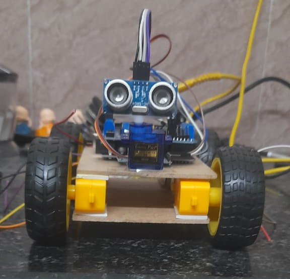

# 🎤 Bluetooth Voice Controlled Robot Car

This mode uses **Arduino Bluetooth Controller (Voice Mode)** app.  

Spoken voice commands are converted into characters and sent via HC-05.

---

## 🎙 Voice Commands

| Voice Word | Bluetooth Data | Action |

|------------|----------------|--------|

| Go | G | Move Forward |

| Stop | T | Stop |

| Back | B | Move Backward |

| Left | L | Turn Left |

| Right | R | Turn Right |

---

## 🛠 Hardware Used

- Arduino UNO  

- HC-05 Bluetooth Module  

- L298N Motor Driver  

- 4 × DC Motors  

---

## 📱 App Required  

**Arduino Bluetooth Controller → Voice Mode**

---

## ▶️ Code File  

`bluetooth\_voice.ino`

---

## 📷 Project Image  

